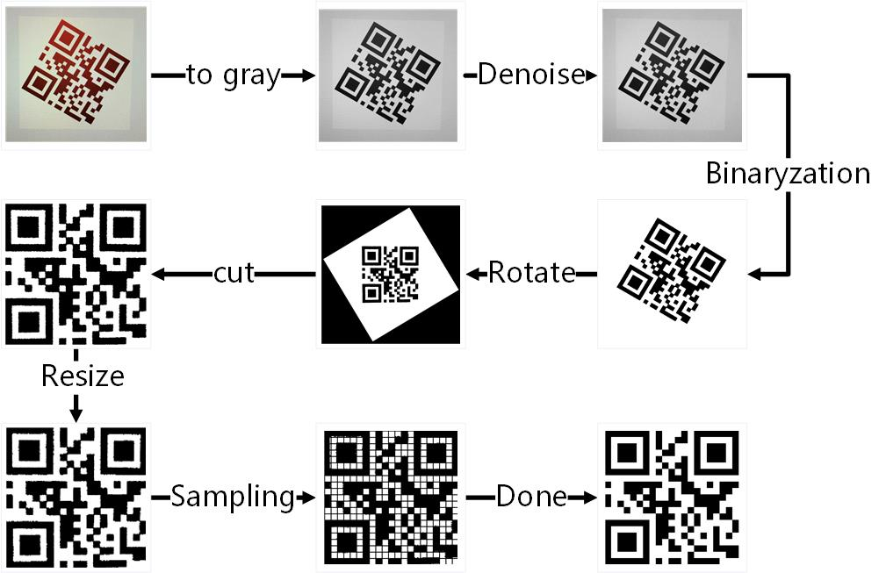

# QRCode
QR code decoder

## QR Code Pre-Processing Part
**QR Code Version 1 only**

### Basic facilities from OpenCV
- cv::Mat
- cv::imread
- cv::imwrite
- cv::resize

### My implementations
- rgb2gray
- medfilter
- im2bw
- rotate
- cut
- sampling

## flow chart
  

## QR Code decoder
UNDO  
